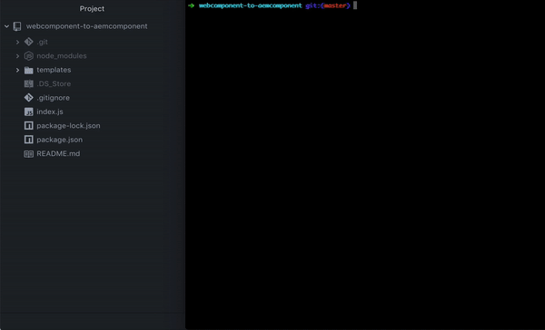

# Webcomponent to AEM component

> Transpile webcomponents to AEM (Adobe Experience Manager) components.

## Introduction

This script will search for webcomponents that are defined in the customElement registry. Then transpiles these components to AEM components.



## Requirements

### Node

Node 10 is required.

### Webcomponents

Either provide a packaged module where webcomponents or custom elements are defined. Or provide a file directly.

## Installing

Install all dependencies required for the script to run.

```
npm install
```

## Run the script

Start the script by providing the following command.

```
npm start
```

It will ask the following questions:

```
Enter a module or file you wish to transpile:
Enter a component group for your library:
Do you wish to use versioned clientlibs?
Enter an AEM app directory (optionally):
```
